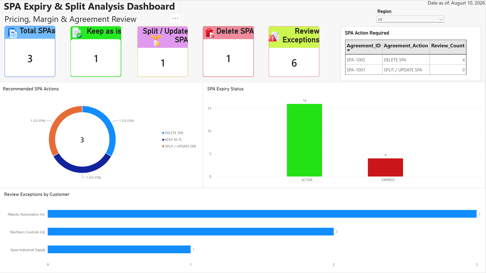

# Special Pricing Agreement (SPA) Expiry & Split Analysis

A business analytics portfolio project that evaluates Special Pricing Agreements (SPAs) to identify pricing benefits, margin risk, expiry risk, and the appropriate action for each agreement.

The project demonstrates an end-to-end analytics workflow using **Excel / Power Query, SQL Server, Python / Pandas, and Power BI**.

## Dashboard Preview



## Business Problem

Special Pricing Agreements can become difficult to manage when multiple customers, materials, pricing structures, expiry dates, and margins are involved.

The goal of this project was to create an analytical process that answers questions such as:

- Is the SPA still providing a pricing benefit to the customer?
- Is the SPA generating an acceptable margin?
- Is the agreement active, expiring, or already expired?
- Should the SPA be kept, updated/split, or deleted?
- Which customers require further review?

The analysis converts detailed customer/material pricing records into actionable agreement-level recommendations.

## Business Logic

Each customer-material combination is evaluated against the applicable customer pricing hierarchy and SPA price.

The pricing hierarchy includes:

**Item Price → MG2 → MPG → Book Price → Stock Price**

The analysis then calculates:

- SPA unit price
- Applicable into-stock/customer price
- Price difference
- SPA benefit
- SPA margin %
- Margin exceptions
- Days to expiry
- Expiry status
- Review flags

At agreement level, the following action rules are applied:

| Condition | Recommended Action |
|---|---|
| No evaluated customers benefit from the SPA | **DELETE SPA** |
| All evaluated customers benefit from the SPA | **KEEP AS IS** |
| Only some customers benefit from the SPA | **SPLIT / UPDATE SPA** |

## Key Results

The sample analysis evaluated **3 SPAs across 20 customer-material evaluations**.

Results:

- **3** total SPAs reviewed
- **1** SPA recommended to **Keep As Is**
- **1** SPA recommended for **Split / Update**
- **1** SPA recommended for **Deletion**
- **6** pricing, margin, or expiry review exceptions identified

The Power BI dashboard provides management-level visibility into SPA actions, expiry status, customer exceptions, and regional filtering.

## Technology Stack

### Excel & Power Query

Excel was used to build the initial business-rule model and validate the pricing logic.

Power Query was used for:

- Data transformation
- Table merges
- Pricing calculations
- SPA benefit logic
- Margin calculations
- Expiry classification
- Exception flags
- Agreement-level summaries

### SQL Server

SQL Server was used to recreate the analytical data model and business logic in a relational environment.

The SQL workflow includes:

1. Data setup and validation
2. Customer, material, SPA, and pricing joins
3. Pricing and analytical calculations
4. Agreement-level aggregation
5. Recommended SPA actions

SQL scripts are available in the [`SQL`](SQL) folder.

### Python / Pandas

Python was used to reproduce and validate the analytical workflow programmatically.

The Python process includes:

- Loading source datasets
- Joining customer, material, SPA, and pricing data
- Calculating customer pricing
- Evaluating SPA benefit
- Calculating margin performance
- Classifying expiry status
- Identifying review exceptions
- Creating agreement-level summaries
- Exporting dashboard-ready datasets

Python code is available in:

[`Python/spa_analysis.py`](Python/spa_analysis.py)

### Power BI

Power BI was used to turn the analytical results into an executive-style dashboard.

The dashboard includes:

- Total SPA KPI
- Keep / Split / Delete recommendations
- Review exception KPI
- SPA action distribution
- Expiry risk visualization
- Customer exception analysis
- Agreement action table
- Interactive regional filtering

The Power BI file and dashboard preview are available in the [`Dashboard`](Dashboard) folder.

## Project Workflow

```text
Raw Business Data
        |
        v
Excel / Power Query
Business Rules & Initial Validation
        |
        v
SQL Server
Data Modeling & Analytical Logic
        |
        v
Python / Pandas
Programmatic Analysis & Validation
        |
        v
Power BI
Management Dashboard & Recommendations
```

## Repository Structure

```text
SPA-Expiry-Split-Analysis/
|
|-- Dashboard/
|   |-- SPA Expiry Split Analysis.pbix
|   |-- dashboard_final.png
|
|-- Data/
|   |-- python_analysis_base.csv
|   |-- python_agreement_summary.csv
|
|-- Excel/SPA Expiry Split Analysis/
|   |-- SPA Expiry Split Analysis 1.xlsx
|
|-- Python/
|   |-- spa_analysis.py
|
|-- SQL/
|   |-- 00_setup_and_data_validation.sql
|   |-- 01_analysis_base.sql
|   |-- 02_agreement_summary.sql
|
|-- README.md
```

## Skills Demonstrated

- Business requirements translation
- Pricing and margin analytics
- Data cleaning and validation
- Relational data modeling
- SQL joins and aggregations
- SQL CASE logic
- Python / Pandas transformations
- Power Query
- Excel analytical modeling
- Power BI dashboard development
- KPI design
- Exception analysis
- Business decision support
- Translating detailed operational data into management recommendations

## Portfolio Context

This project demonstrates how a business analyst, sales operations analyst, or revenue operations analyst can combine multiple analytical tools to solve a practical pricing and agreement-management problem.

The emphasis is not only on technical implementation, but also on translating detailed operational data into clear recommendations for commercial and management stakeholders.

---

*Portfolio project built using synthetic data for demonstration purposes.*
